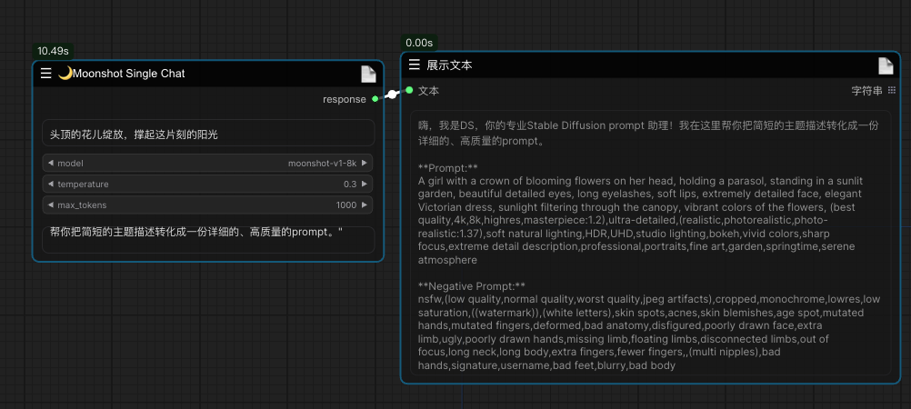
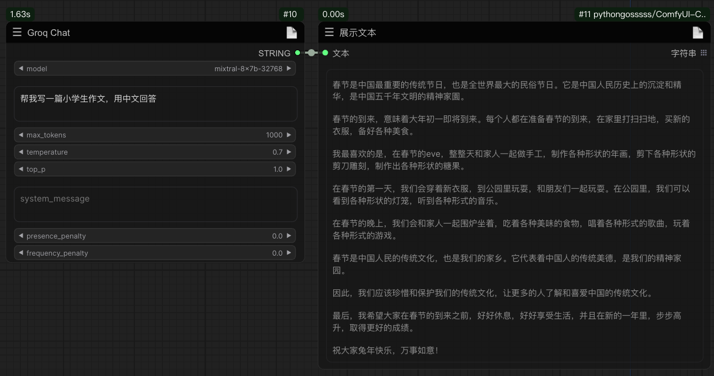
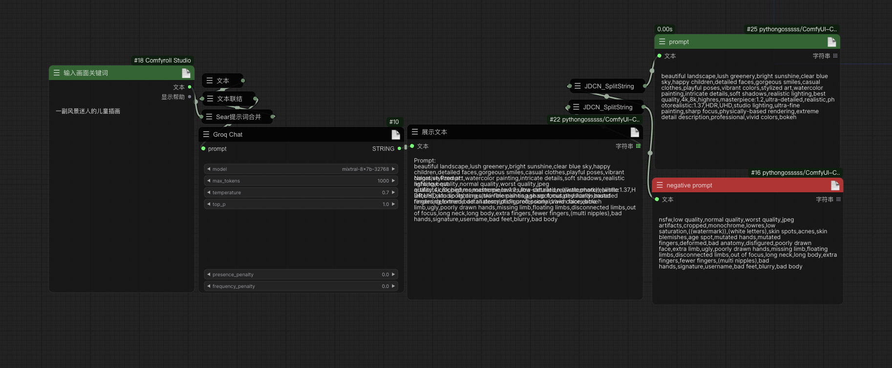

# comfy-groqchat
目前节点的对话功能基于Groq API（ https://console.groq.com/keys ）和 kimi API  (https://platform.moonshot.cn/console/api-keys)， 请在相应的网站获取，  填入到nodes文件夹下的config.json文件中。通过API的调用，可以实现单轮或者多轮chat，以实现正反提示词生成和报错指南等，此外节点还整合了基于moondream2和PaliGemma大模型的的图片反推节点。
<details>
presence_penalty（存在惩罚）和frequency_penalty （频率惩罚）这两个参数的作用： `presence_penalty` 和 `frequency_penalty` 是用于控制语言模型输出多样性和重复性的参数。让我详细解释一下它们的作用：
1. presence_penalty（存在惩罚）:
   - 范围通常是 -2.0 到 2.0。
   - 这个参数用于惩罚新token基于它们是否已经出现在文本中。
   - 正值会增加模型谈论新主题的可能性。
   - 负值会使模型更倾向于重复已经说过的内容。
   - 值为0时不会有影响。

2. frequency_penalty（频率惩罚）:
   - 范围通常也是 -2.0 到 2.0。
   - 这个参数根据新token到目前为止在文本中出现的频率来惩罚它们。
   - 正值会降低模型逐字重复同样短语的可能性。
   - 负值会鼓励模型重复常用词。
   - 值为0时不会有影响。

这两个参数的主要区别：
- `presence_penalty` 只关心一个token是否出现过，不管出现了多少次。
- `frequency_penalty` 则考虑了一个token出现的次数，出现次数越多，惩罚越大。

使用示例：
1. 如果你想要模型产生更多样化的内容，可以设置较高的正值，例如：
   ```python
   presence_penalty=0.6, frequency_penalty=0.8
   ```

2. 如果你希望模型更专注于特定主题，可以使用较低的值或轻微的负值，例如：
   ```python
   presence_penalty=0, frequency_penalty=-0.2
   ```

3. 对于大多数一般用途，保持这两个值为0或接近0通常效果不错：
   ```python
   presence_penalty=0, frequency_penalty=0
   ```
此外在groqchat.py节点中，temperature和top_p是用于控制语言模型输出的随机性和多样性的两个重要参数。

1. temperature（温度）:
   - 范围通常是0到2.0，默认值通常为0.7。
   - 控制输出的随机性。
   - 较低的值（接近0）会使输出更加确定性和一致，模型更倾向于选择最可能的下一个词。
   - 较高的值会增加随机性，使输出更加多样化和创造性，但可能也会引入更多不相关或不连贯的内容。
   - 当temperature为0时，模型总是选择最可能的下一个词，结果变得完全确定。

2. top_p（核采样）:
   - 范围是0到1.0，默认值通常为1.0。
   - 这是一种称为"核采样"的替代性采样方法。
   - top_p控制模型考虑的词的累积概率阈值。
   - 例如，如果top_p设为0.9，模型将仅考虑累积概率达到90%的最可能的词。
   - 较低的值会使输出更加集中和确定，而较高的值允许更多的多样性。

这两个参数的使用建议：

1. 对于需要高度一致性和准确性的任务（如问答或事实生成），使用较低的temperature（如0.3-0.5）或较低的top_p值。

2. 对于创意写作或需要更多多样性的任务，使用较高的temperature（如0.7-1.0）或接近1的top_p值。

3. 通常不同时调整这两个参数，而是选择其中一个进行调整。temperature更常用，而top_p在某些特定场景下可能更有效。

4. 实际应用中，这些参数的最佳值往往需要通过实验来确定，因为它们的效果可能因任务和所需输出类型而异。

在groqchat.py节点中，这两个参数允许用户根据具体需求调整模型输出的特性，从而在一致性和创造性之间找到适当的平衡。
且在实际应用中，这些参数的最佳值往往需要通过实验来确定，因为它们的效果可能因不同的任务和所需的输出类型而异。对于Groq的API，你可能需要查看其文档以确认这些参数是否完全按照上述方式工作，因为不同的AI服务提供商可能会有细微的实现差异。
<summary>参数详解</summary>
</details> 

# Usage:
2024-07-27  
在groqchat节点中新增了reset conversation参数，值为True时，即可开启单轮对话功能；新增了prompt_extractor.py节点，分来分离文本中的正负向提示词。 

2024-07-24  
1.基于groq API的节点，新增了llama3.1模型的支持。
2.优化所有节点的分类，新增moondream2的图片反推节点dwimage2.py，模型支持手动下载到./ComfyUI/models/LLavacheckpoints/files_for_moondream2目录下（所有文件放在这个文件夹下）。 模型地址：https://huggingface.co/vikhyatk/moondream2/tree/main

2024-07-14  
新增了SD3LongCaptionerV2这个图像反推节点的模型加载和存储目录，考虑到模型偏大的问题，可以手动从huggingface上下载模型放到ComfyUl/models/LLavacheckpoints/files_for_sd3_long_captioner_v2这个目录下，模型地址https://huggingface.co/gokaygokay/sd3-long-captioner-v2

再次更新了基于kimi API的文件对话功能的file_based_chat节点，能实现低配的知识库功能，上传文件格式支持pdf、doc、xlsx、ppt、txt、图片等。具体应用示例，可以上传知识库中的”常见报错问题(文档可在库中获得，来源K佬)”，来解决部分报错问题

新更新了对 kimi api的支持，包括“Moonshot Single Chat”和“Moonshot Multi Chat”两个节点，分别支持单轮或多轮对话。API申请地址 https://platform.moonshot.cn/console/info
单轮对话，如下所示：

多轮对话：


Groq nodes are based on the groq cloud API.The following four models are currently supported.
* gemma-7b-it
* llama3-70b-8192
* mixtral-8x7b-32768
* llama3-8b-8192

The API was requested through https://console.groq.com/keys, which had not launched a paid plan as of the time of publication. Fill the api key into the "config.json" file.
However, there are corresponding restrictions, as shown below:

____
## Example:

The use of nodes enables the generation of positive and negative cues in 2 seconds through specific cues.

Picture with workflow
____
##Statement：
The GroqChat node follows the MIT license agreement, and some of the functional code comes from other open source projects. Thanks to the original authors. For commercial use, please refer to the original project license agreement for authorization.Thanks also to Google's open source PaliGemma model.

